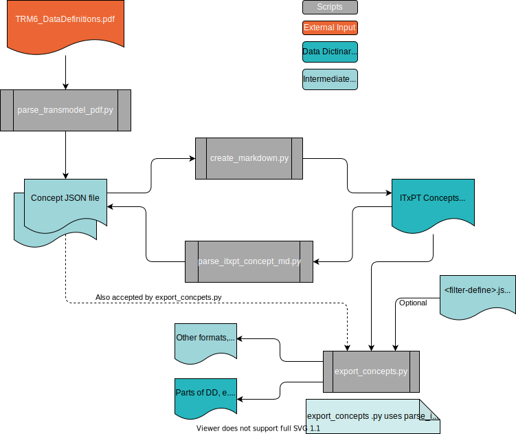

# Data Dictionary Tools

This folder contains tools/scripts to make working with the ITxPT Data Dictionary easier. 

Currently those tools are for generating and extracting from the ITxPT Concepts Markdown file, but more tools/scripts for other purposes may be added in the future. 

## Working with the Transmodel/ITxPT Concepts

Several scripts are provided that together makes it possible to "apply operations" to the ITxPT Data Dictionary as if it was a structured storage. 

