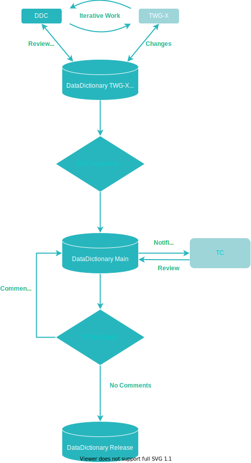

This is the Ways of Working document for the Data Dictionary Committee. It documents how the DDC works, as agreed by TC. 

# General flow

The diagram below shows how the DDC will work with Concepts

While that may be somewhat different for other DDC artifacts that requires approval, it should still be mostly like this. 

# Release Cadence

When there are new content the Data Dictionary aims for releases with a three month cadence. As updates will vary considerably over time, this will in practice be both more and less often according to need. 

# Versioning scheme 

The semver versioning scheme used by other ITxPT documents, APIs and specifications, does not apply well to the Data Dictionary. Any reasoning about the impact of changes must happen when the specifications _using_ the Data Dictionary is updated, not in the Data Dictionary itself. 

Because of this a Year-Month version will be used for Data Dictionary releases. So a July 2021 release will be the **2107** release, a January 2022 will be **2201**, etc.

> Is the Data Dictionary Baselined rather than Released? Not the most important question, but perhaps worth thinking about