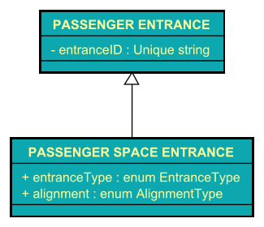
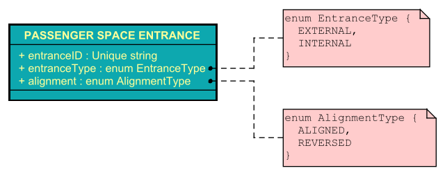
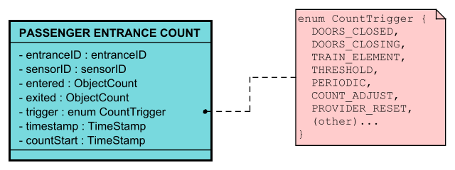
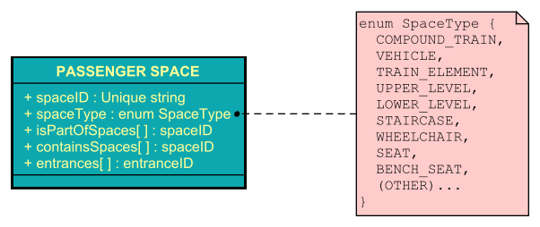
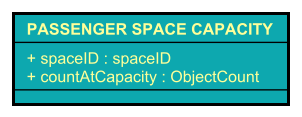
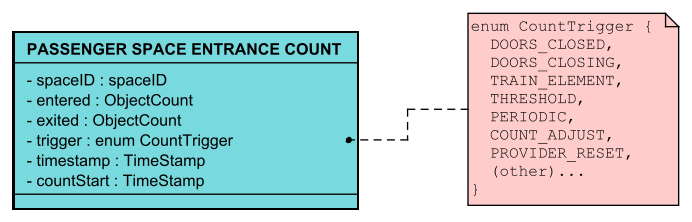
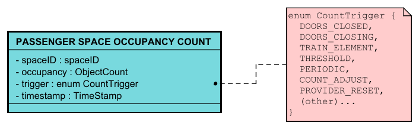
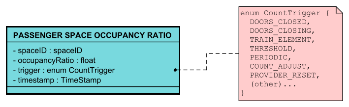

# ITxPT Data Dictionary for APC #

- [ITxPT Data Dictionary for APC](#itxpt-data-dictionary-for-apc)
  - [PASSENGER ENTRANCE](#passenger-entrance)
  - [PASSENGER SPACE ENTRANCE](#passenger-space-entrance)
  - [PASSENGER ENTRANCE COUNT](#passenger-entrance-count)
  - [PASSENGER SPACE](#passenger-space)
  - [PASSENGER SPACE CAPACITY](#passenger-space-capacity)
  - [PASSENGER SPACE ENTRANCE COUNT](#passenger-space-entrance-count)
  - [PASSENGER SPACE OCCUPANCY COUNT](#passenger-space-occupancy-count)
  - [PASSENGER SPACE OCCUPANCY RATIO](#passenger-space-occupancy-ratio)
  
This document contains the ITxPT Data Dictionary Concepts covering the Automatic Passenger Counting (APC) domain.

## PASSENGER ENTRANCE ##

**Definition:**
A physical or virtual boundary point through which passengers can enter or exit, e.g. a vehicle door. A PASSENGER ENTRANCE has a designated enter-direction and a designated exit-direction.

|Property| Value |
| :---- | :-------------- |
|**Source:**| ITxPT |
|**Used in:**| APC |
|**Data Class:**|  Atomic  |
|**Notes:**| \<Explanatory or illustrative material\> |

**Model:**

## PASSENGER SPACE ENTRANCE ##

**Definition:**
A [PASSENGER ENTRANCE](#passenger-entrance) used as an entry- and/or exit- point to or from a certain [PASSENGER SPACE](#passenger-space) along with information if the designated exit and entry directions of the PASSENGER ENTRANCE are aligned or reversed in relation to the PASSENGER SPACE.

|Property| Value |
| :---- | :-------------- |
|**Source:**| ITxPT |
|**Used in:**| APC |
|**Data Class:**|  Molecular  |
|**Notes:**| \<Explanatory or illustrative material\> |

**Model:**

## PASSENGER ENTRANCE COUNT ##

**Definition:**
Number of passengers and other objects that have entered and exited through a specific [PASSENGER ENTRANCE](#passenger-entrance) during a time span or since some implicit or explicit previous time/event. A possible implementation of LOGGABLE OBJECT.

|Property| Value |
| :---- | :-------------- |
|**Source:**| ITxPT |
|**Used in:**| APC |
|**Data Class:**|  Molecular  |
|**Notes:**| \<Explanatory or illustrative material\> |

**Model:**

## PASSENGER SPACE ##

**Definition:**
A passenger area within a VEHICLE. It may be limited to only a part of a VEHICLE such as a TRAIN ELEMENT, upper deck/lower deck, first class compartment or a bounded open space. A PASSENGER SPACE can be part of, overlap with, and be made up of other PASSENGER SPACEs.

|Property| Value |
| :---- | :-------------- |
|**Source:**| ITxPT |
|**Used in:**| APC |
|**Data Class:**|  Molecular  |
|**Notes:**| \<Explanatory or illustrative material\> |

**Model:**

## PASSENGER SPACE CAPACITY ##

**Definition:**
The number of passengers and other objects that are present in a [PASSENGER SPACE](#passenger-space) when it is at 100% capacity.

|Property| Value |
| :---- | :-------------- |
|**Source:**| ITxPT |
|**Used in:**| APC |
|**Data Class:**|  Molecular  |
|**Notes:**| \<Explanatory or illustrative material\> |

**Model:**

## PASSENGER SPACE ENTRANCE COUNT ##

**Definition:**
Number of passengers and other objects that entered and exited a specific [PASSENGER SPACE](#passenger-space) during a time span or since some implicit or explicit previous time/event. A possible implementation of LOGGABLE OBJECT. It is in essence an aggregation of relevant [PASSENGER ENTRANCE COUNTs](#passenger-space-entrance-count) according to [PASSENGER SPACE ENTRANCE](#passenger-space-entrance) information.

|Property| Value |
| :---- | :-------------- |
|**Source:**| ITxPT |
|**Used in:**| APC |
|**Data Class:**|  Molecular  |
|**Notes:**| \<Explanatory or illustrative material\> |

**Model:**

## PASSENGER SPACE OCCUPANCY COUNT ##

**Definition:**
Number of passengers and other objects that are in a [PASSENGER SPACE](#passenger-space) at a given time. A possible implementation of LOGGABLE OBJECT.

|Property| Value |
| :---- | :-------------- |
|**Source:**| ITxPT |
|**Used in:**| APC |
|**Data Class:**|  Molecular  |
|**Notes:**| \<Explanatory or illustrative material\> |

**Model:**

## PASSENGER SPACE OCCUPANCY RATIO ##

**Definition:**
A fraction describing the current level of occupancy. Should be close to [PASSENGER SPACE OCCUPANCY COUNT](#passenger-space-occupancy-count) divided by [PASSENGER SPACE CAPACITY](#passenger-space-capacity).

|Property| Value |
| :---- | :-------------- |
|**Source:**| ITxPT |
|**Used in:**| APC |
|**Data Class:**|  Molecular  |
|**Notes:**| \<Explanatory or illustrative material\> |

**Model:**

